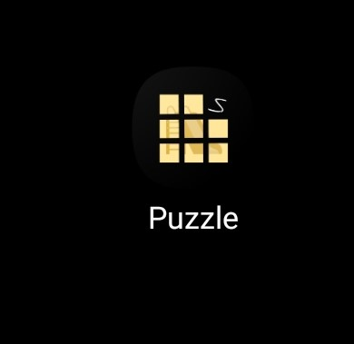
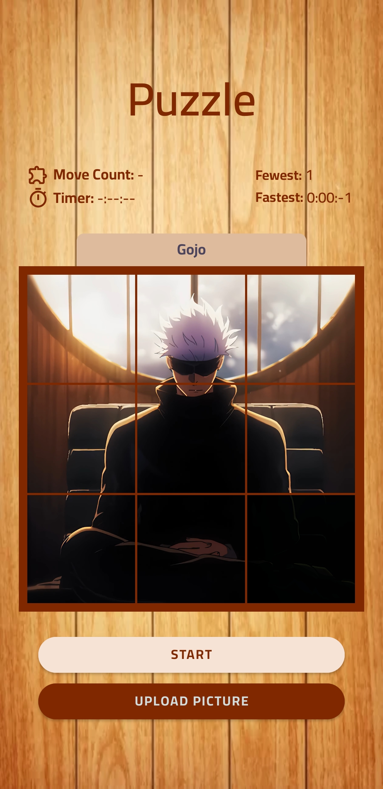
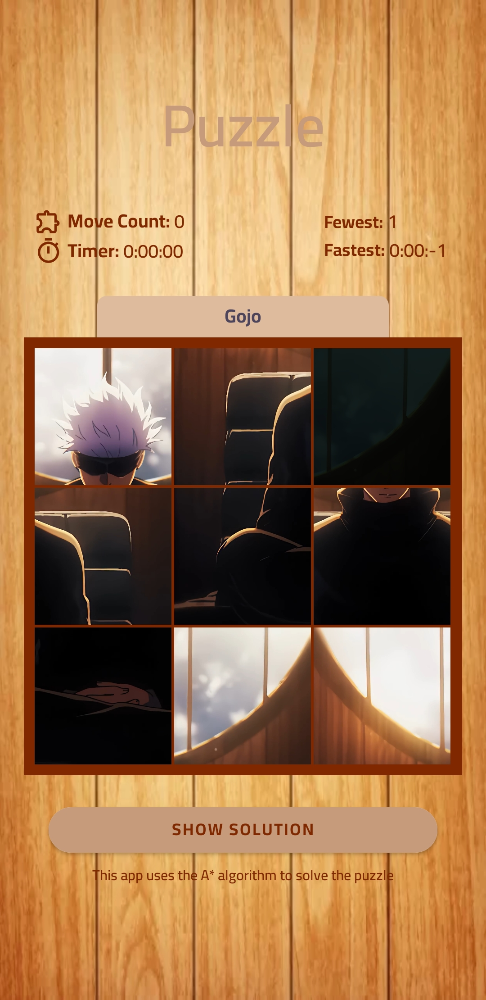
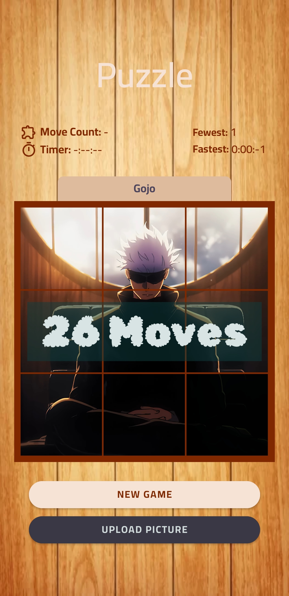

# Puzzle Android Application

Welcome to the Puzzle Android Application! This application allows users to solve puzzles using custom images. It includes features such as generating solutions, moving steps, and step count.



## Features

- **Custom Image**: Users can upload their own images to create unique puzzles.
- **Solution Generator**: The app provides a solution for the puzzle.
- **Move Steps**: Users can move puzzle pieces to solve the puzzle.
- **Step Count**: The app counts and displays the number of steps taken to solve the puzzle.

## Screenshots

### Splash Screen


### Home Screen


### Puzzle Screen


### Solution Screen


### Solution Screen


## Installation

To get a local copy up and running, follow these simple steps.

### Prerequisites

- Android Studio
- Kotlin

### Installation Steps

1. Clone the repository
   ```sh
   git clone https://github.com/Snickers-khalil/Puzzle-APP.git


### Key Additions:

1. **Email Address with Subject and Body**:
   - The mailto link includes a subject and body to make it easier for users to send you an email.
   - The `mailto` link format is: `mailto:email@example.com?subject=Subject&body=Body`.

Example link breakdown:
- **Email**: `mailto:khalilbarhoui@hotmail.com`
- **Subject**: `?subject=Puzzle%20App%20Inquiry`
- **Body**: `&body=Hello%20Khalil%2C%0A%0AI%20have%20a%20question%20about%20your%20Puzzle%20Android%20Application.%0A%0AThank%20you!%0A`

This formatting ensures that users have a pre-filled subject and body when they click the email link, making it more convenient to contact you.

### Key Additions:

1. **Main Contact**: Added your email with a mailto link.
2. **Phone Number**: Added your phone number.
3. **WhatsApp**: `https://wa.me/<+21651345199>`

### Adding the WhatsApp Link:

